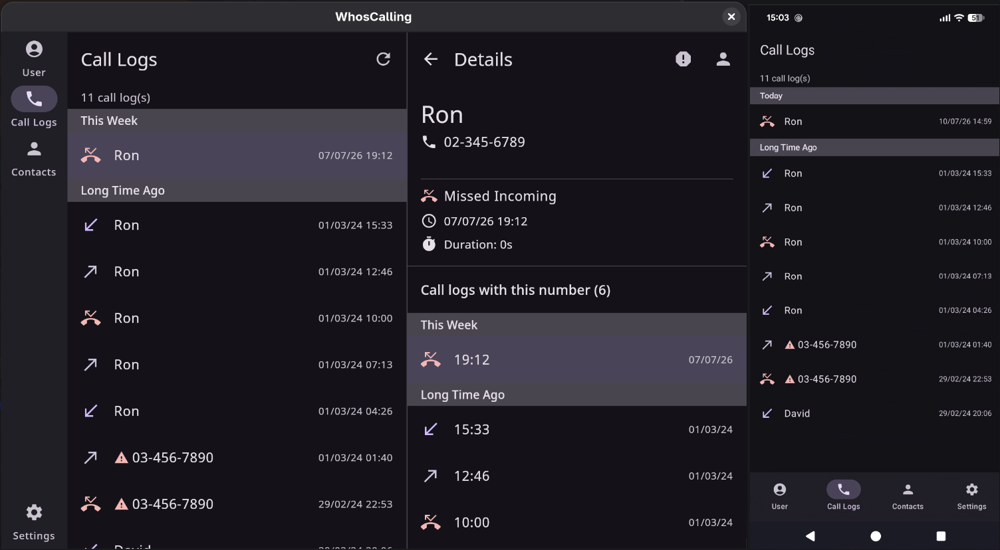

# WhosCalling

  

A **Kotlin Multiplatform (KMP)** application for viewing your home phone call history directly from your router.

The app securely logs into your router's web interface, extracts the call log table, and presents it in a modern native UI. It also allows managing contacts and marking phone numbers as spam.

> **Current router support:** Partner routers

---

## Features

- View incoming, outgoing, and missed home phone calls
- Fetch call logs directly from the router web interface
- Save and manage contacts
- Mark phone numbers as spam
- Validate and format phone numbers
- Auto refresh call logs.
- Secure credential storage using platform-native APIs
- Responsive UI adapted for desktops, tablets, and smartphones
- Cross-platform with Kotlin Multiplatform

---

## Architecture

The project follows **Clean Architecture** principles with the **MVVM (Model–View–ViewModel)** pattern.

The data layer is organized using the **Repository Pattern**, where repositories coordinate between **Remote Data Sources** (router communication) and **Local Data Sources** (persistent storage), providing a single source of truth for the application.

### Architecture Components

- Clean Architecture
- MVVM (Model–View–ViewModel)
- Repository Pattern
- Local & Remote Data Sources
- Dependency Injection with Koin
- Kotlin Multiplatform shared business logic
- Jetpack Compose Multiplatform UI

---

## Technologies Used

| Technology | Purpose |
|------------|---------|
| Kotlin Multiplatform | Shared business logic |
| Jetpack Compose Multiplatform | Declarative UI |
| Material 3 | Modern UI components |
| Koin | Dependency Injection |
| KSoup | HTML parsing and web scraping |
| libphonenumber | Phone number validation and formatting |
| SRP-6a | Secure authentication with Partner routers |
| JUnit | Unit testing |
| Turbine | Testing Kotlin Flows |

---

## Authentication & Security

The application authenticates with supported Partner routers using the **SRP-6a (Secure Remote Password)** protocol.

Credentials are securely stored using each platform's native secure storage solution:

| Platform | Secure Storage |
|----------|----------------|
| Android | Encrypted SharedPreferences |
| Windows | DPAPI |
| Linux | `secret-tool` (Secret Service API) |

---

## Testing

The shared business logic is covered by unit tests using:

- **JUnit** for unit testing
- **Turbine** for testing Kotlin Flows

---

## How It Works

1. The user enters their router credentials.
2. The app authenticates using the SRP-6a protocol.
3. It retrieves the router's call log page.
4. The HTML is parsed using KSoup.
5. Call entries are mapped into application models.
6. The UI displays the calls together with saved contacts and spam indicators.

---

## Supported Platforms

- Android
- Windows
- Linux

---

## Current Limitations

- Currently supports only Partner routers.
- Changes to the router's web interface may require updates to the scraper.

---

## Future Ideas

- Support automatic spam detection.
- Support additional router manufacturers

---

## License

This project is licensed under the MIT License (or your preferred license).
